# Congressional Record Transcripts

A small, resumable pipeline that downloads **speech/section-level transcripts** from the
U.S. **Congressional Record** (the daily record of proceedings in the House and Senate) and
stores each as a plain-text file plus structured metadata.

Data comes from the authoritative federal source: the **GovInfo API** (`CREC` collection),
operated by the U.S. Government Publishing Office.

## What you get

For every "granule" (an individual speech, vote, prayer, or section within a day's Record):

```
data/
├── raw/<year>/<packageId>/<granuleId>.txt        # the transcript text
├── raw/<year>/<packageId>/<granuleId>.mods.xml   # original MODS metadata
└── manifest.jsonl                                # one JSON row per granule (index)
```

Each `manifest.jsonl` row includes: `granuleId`, `packageId`, `granuleClass`
(`HOUSE` / `SENATE` / `EXTENSIONS` / `DAILYDIGEST` / `FRONTMATTER`), `title`, `dateIssued`,
`congress`, `session`, `chamber`, the Congressional Record `citation`, the list of
`member_names` and `bioguide_ids` mentioned, character count, and the relative file paths.
Rows recovered from files already on disk (when the manifest was lost) carry the same fields
plus `"backfilled": true`.

## Coverage

The GovInfo `CREC` digital collection runs from **1994-01-01 to the present**. (Earlier years
exist only in the scanned *Bound* Congressional Record and are not covered here.) This pipeline
collects **all sections** of the daily Record by default — `HOUSE`, `SENATE`, `EXTENSIONS`,
`DAILYDIGEST`, and `FRONTMATTER` (narrow with `--classes`).

### Two ingest paths — check coverage before you trust a date

The repository fills its corpus through **two independent pipelines that keep separate
bookkeeping**. Reading either one alone will give you the wrong answer about how current
the data is:

| Path | Driver | Bookkeeping | Role |
| --- | --- | --- | --- |
| GovInfo **API** | `fetch_crec.py` | `data/manifest.jsonl` (+ transient `data/manifest_w*.jsonl` worker shards) | Granule text + MODS on disk |
| GovInfo **bulk** | `scripts/bulk_pipeline.py` | `data/interim/turns/*.parquet` | **The corpus the analysis code actually reads** |

`data/manifest.jsonl` is *not* the source of truth for coverage — the bulk turn Parquets are.
Always start with:

```bash
.venv/bin/python scripts/coverage_status.py
```

It prints the true date range of every ingest path, writes `data/coverage_status.json`, and
warns when:

* worker shards (`data/manifest_w*.jsonl`) hold granules missing from `data/manifest.jsonl`
  → fix with `.venv/bin/python scripts/merge_manifests.py`;
* `data/manifest.jsonl` contains duplicate `granuleId` rows → same fix;
* `data/manifest.jsonl` has **interior holes** — days inside its own date range that the
  analysis corpus covers but it does not. Comparing newest dates alone is not enough: the
  manifest currently ends on the same day as the corpus while missing 568 days in between;
* the analysis corpus is more than `--gap-days` (default 30) behind today
  → fix with `.venv/bin/python scripts/bulk_pipeline.py`;
* a package logged in `data/bulk/_errors.txt` is genuinely absent from the corpus.
  That log is **append-only** — a package that failed once and was ingested on a later
  run stays listed forever — so entries are resolved against the corpus and only real
  gaps are reported.

Run it after any ingest job, and before quoting a coverage date.

## Setup

```bash
cd congressional_record
uv venv .venv && uv pip install -r requirements.txt
# or: python -m venv .venv && .venv/bin/pip install -r requirements.txt
```

### API key (required for real runs)

The GovInfo API is rate-limited per key. The shared `DEMO_KEY` allows only ~50 requests/day —
fine for a quick poke, but **far too low** for even a single month. Get a free key in seconds:

1. Sign up at <https://api.data.gov/signup/> (the key works for the GovInfo API).
2. Copy `.env.example` to `.env` and set `GOVINFO_API_KEY=<your key>`.

A real key allows ~1,000 requests/hour. Use `--min-interval` to stay under that ceiling.

## Usage

```bash
# Validate on a single month
.venv/bin/python fetch_crec.py --sample-month 2024-01

# Full backfill of the digital collection (long-running; resumable).
# Omit --end so it always runs through today rather than a stale hardcoded date.
.venv/bin/python fetch_crec.py --start 1994-01-01 --min-interval 0.5

# Just the House + Extensions for one year
.venv/bin/python fetch_crec.py --start 2023-01-01 --end 2023-12-31 --classes HOUSE EXTENSIONS

# Quick smoke test: stop after 5 new granules
.venv/bin/python fetch_crec.py --sample-month 2024-01 --classes HOUSE --limit 5
```

### Options

| Flag | Description |
|---|---|
| `--start` / `--end` | Date range `YYYY-MM-DD` (end defaults to today). |
| `--sample-month YYYY-MM` | Convenience: one calendar month (overrides start/end). |
| `--classes` | granuleClass values to keep (default: all). |
| `--out-dir` | Output directory (default: `./data`). |
| `--api-key` | Override `GOVINFO_API_KEY`. |
| `--min-interval` | Min seconds between API calls (throttle for the ~1,000/hr limit). |
| `--limit` | Stop after N newly downloaded granules (testing). |
| `--overwrite` | Re-download granules already on disk. |
| `-v` | Debug logging. |

## Resumability

Progress is recorded in `data/manifest.jsonl` and on disk. Re-running the **same command**
skips granules already downloaded, so a large backfill can be stopped (Ctrl-C) and resumed
safely. If the run is persistently rate-limited it aborts cleanly with guidance rather than
hanging.

## Notes & caveats

- A full 1994→present backfill is large (tens of GB, hundreds of thousands of granules).
- `data/` and `.env` are git-ignored; no credentials are committed.
- `granuleClass` is GovInfo's own classification; a granule's `title` ("House of
  Representatives") can differ from its class (e.g. a House proceeding may appear in the
  `SENATE`-numbered page sequence). Filter on `granuleClass` for the chamber.

## Analysis: measuring changes in congressional comity and conflict

Beyond downloading, this repo includes a reusable **analysis pipeline** (`analysis/`) that
scores every speaker turn for disclosed lexical markers of civility and conflict and produces
time-series charts. It unifies two corpora into one speaker-turn table:

* **Stanford *hein* corpus** (1873–2017, congresses 043–114) — already speaker-segmented with
  party labels. Download the `hein-bound.zip` / `hein-daily.zip` from
  <https://data.stanford.edu/congress_text> into `data/raw/` (extract not required; the
  ingester reads the zips directly). On macOS these are zip64 >4 GB — use `ditto`/Python
  `zipfile`, not `unzip`, if you do extract them.
* **GovInfo CREC** (2017→present) — the `fetch_crec.py` output above; granules are segmented
  into speaker turns and party is attributed from MODS. For a **much faster** bulk load that
  bypasses the API's rate limit, use `ingest-govinfo-bulk` (below), which downloads whole-day
  package zips directly from `www.govinfo.gov/content/pkg` (no API key, not rate-limited),
  parses each day's MODS per granule, and deletes each zip after ingest.

### Key figures

These publication figures are generated from real Stanford/GovInfo Congressional Record text and
are intentionally tracked under `outputs/figures/`. All rates are per 1,000 words unless noted,
and every panel carries the coverage caveat described under
[Two ingest paths](#two-ingest-paths--check-coverage-before-you-trust-a-date). Note that the
primary source switches from Stanford Hein to GovInfo CREC in 2017, so treat a step change
across that year as possibly a source artifact rather than a real shift.
Regenerate them all with `python scripts/update.py`.

#### At a glance

Six validated measures on one canvas — the fastest way to see the long-run shape of the data.

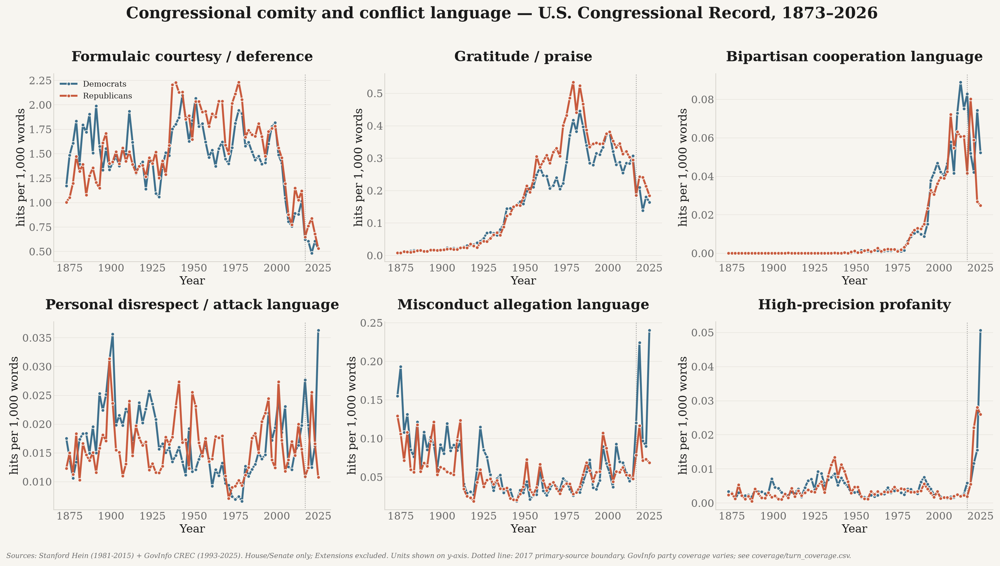

The same six panels for each chamber separately, which separates institutional differences from
partisan ones. Giving each chamber its own figure — and its own y-scale — keeps two series per
panel instead of four, and stops the House's much higher rates from flattening the Senate.

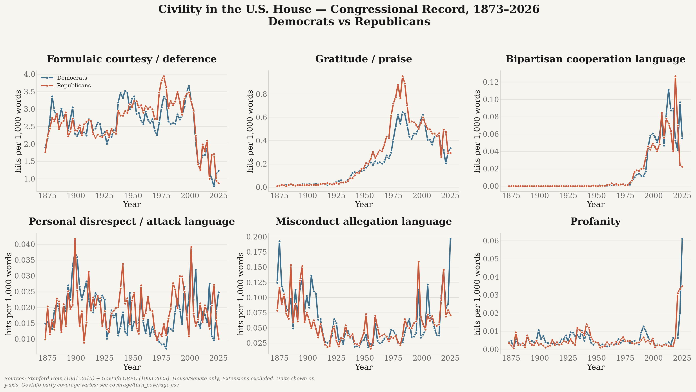

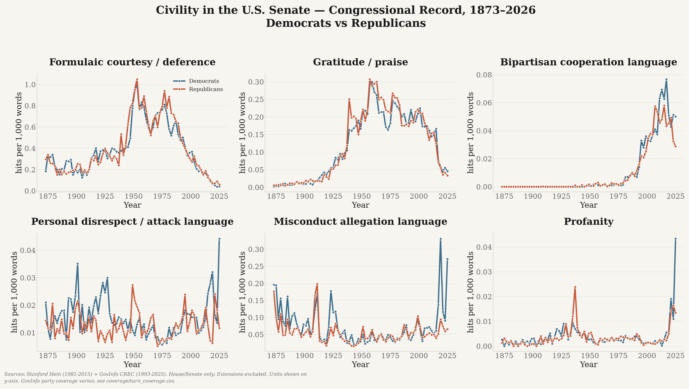

#### Courtesy and cooperation

Formulaic deference (“my distinguished colleague”, “the gentleman from…”) is the most
institutionalised form of comity, and the most sensitive to changes in floor ritual.

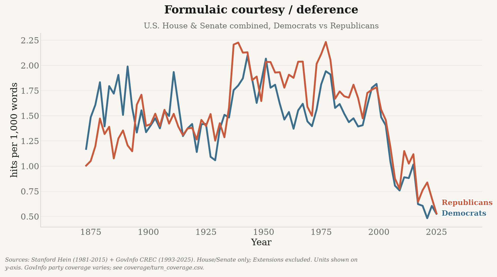

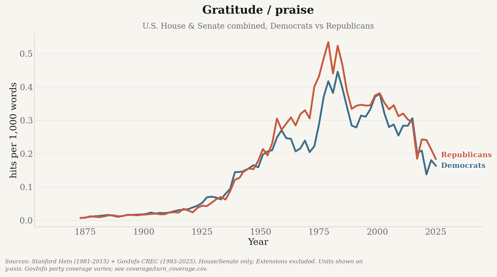

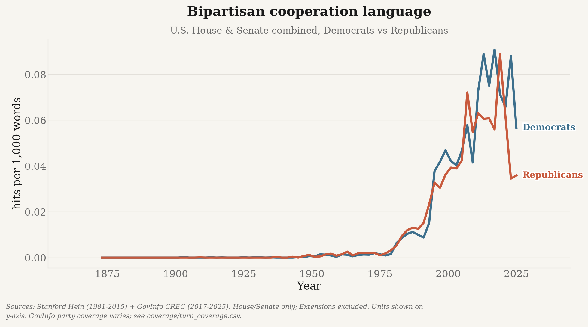

#### Conflict

Personal disrespect, allegations of misconduct, and profanity — the three negative families.
Profanity uses a high-precision curated list rather than a broad word list, so it is rare by
construction.

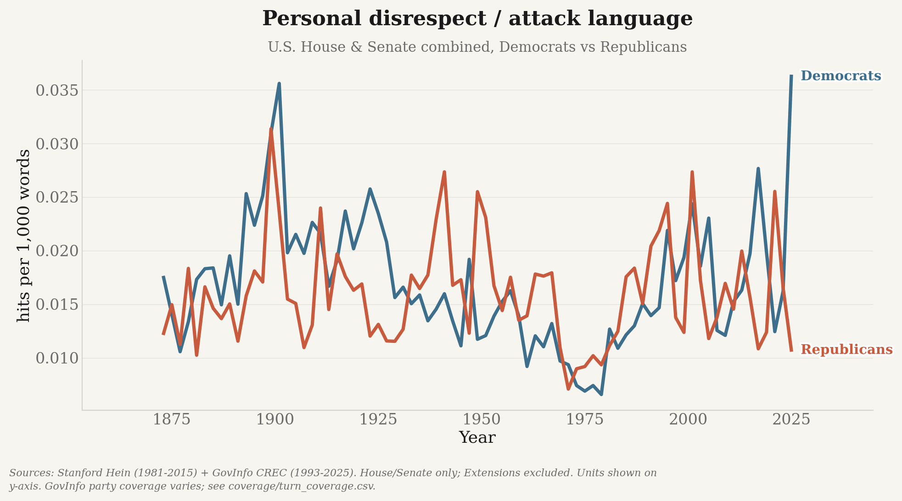

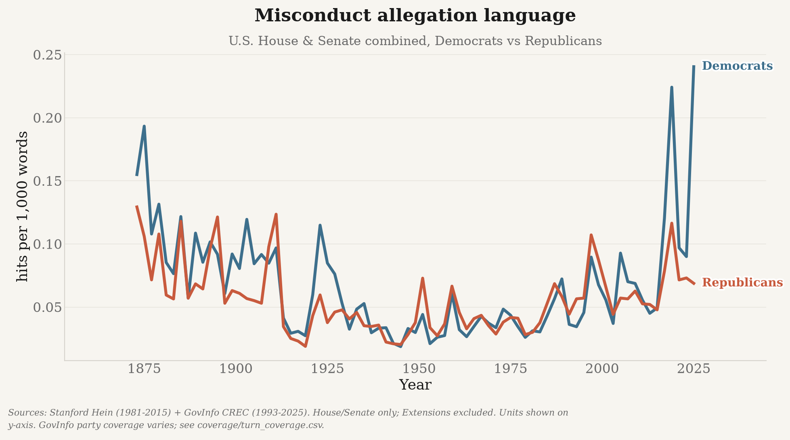

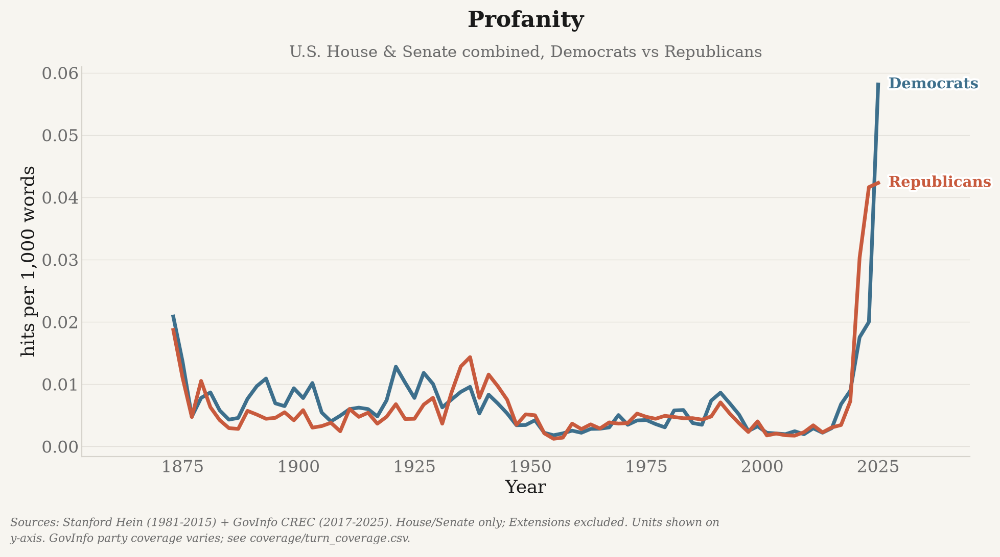

#### Directed at the other party

The measures above count language anywhere in a speech. These normalise by *references to the
other party*, so they answer a sharper question: when a member invokes the other side, how do
they talk about them? Proximity does not prove the language is aimed at the reference.

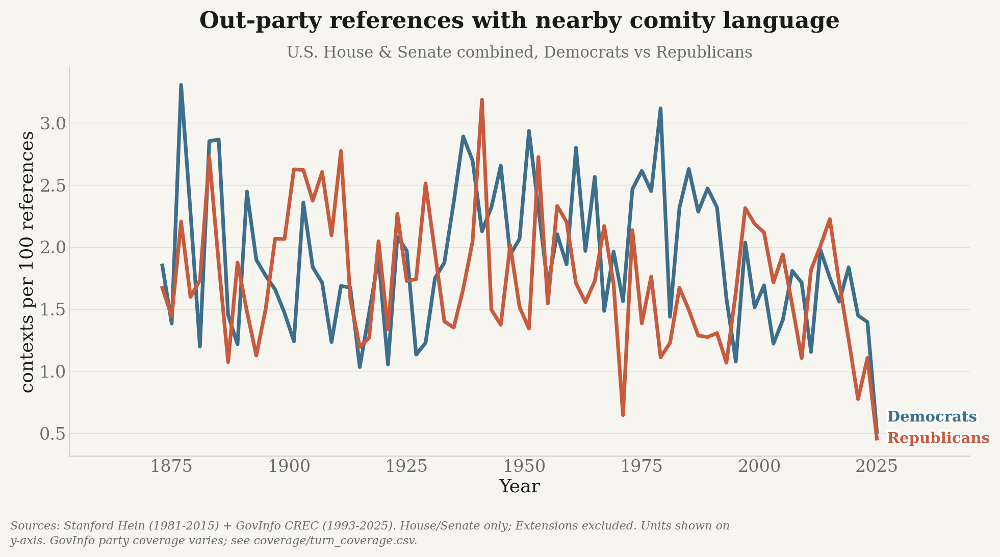

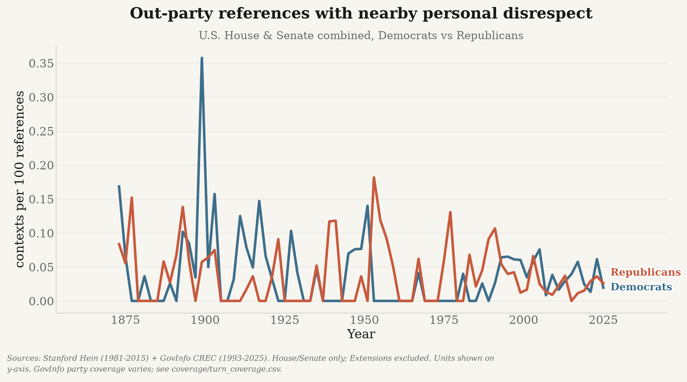

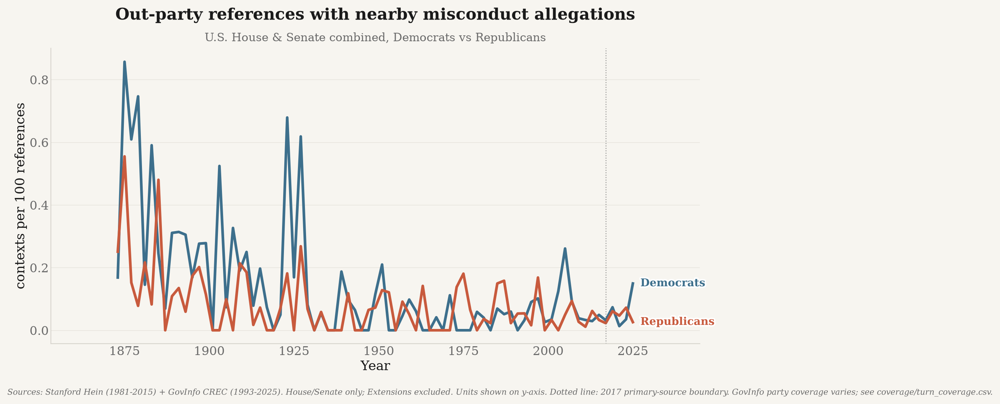

Party asymmetry in that directed disrespect, with equal House/Senate weights — above zero means
the Democratic rate is higher, below zero the Republican rate.

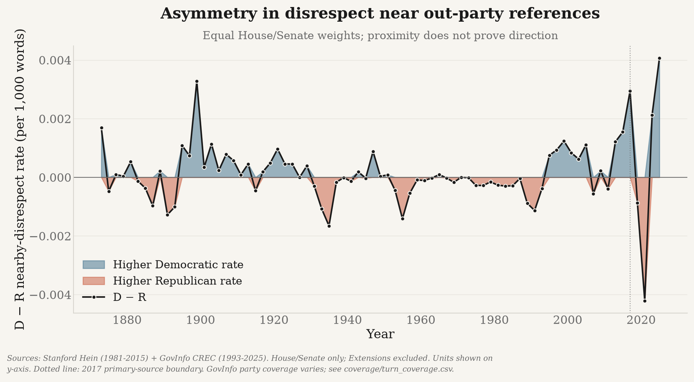

The remaining figures — per-chamber breakdowns of each family, plus supplemental measures such as
ideological labelling, out-party reference volume, and the “Democrat party” pejorative — are in
[`outputs/figures/`](outputs/figures/).

### What it measures

* **Formulaic courtesy/deference**, **gratitude/praise**, and **bipartisan cooperation** as
  separate positive-language components rather than one undifferentiated comity score
* **Personal disrespect/attack** language, **misconduct allegation language**, and
  **profanity** as separate categories. Profanity uses a narrow, hand-curated list rather than a
  broad word list, so ordinary words are never counted. Misconduct words are allegations in text,
  not evidence that misconduct occurred.
* **Identity slurs** and **ideological labels** as separate diagnostics; ideological labels do
  not automatically count as personal disrespect.
* **Cross-party reference context** — out-group references resolved to the speaker's party, plus
  comity, disrespect, or misconduct terms **near** each reference. Proximity does not prove target.
  Context-normalized outputs report affected contexts per 100 out-party references as well as
  nearby hit rates per 1,000 total words.
* The **"Democrat party"** pejorative marker; optional **VADER sentiment** (see *Toxicity* below)

All lexical rates are per 1,000 words, grouped by `(congress, chamber, party)`, so overall
trends split by party and chamber, plus D-R differences in nearby language, can all be plotted.
Aggregation also writes `data/processed/coverage/turn_coverage.{csv,parquet}` with total,
procedural, and D/R/I-attributed turn/word coverage by source, Congress, and chamber.

**Fuzzy keyword matching.** Most lexicon terms match their morphological variants by default
(`Scorers(fuzzy=True)`): single words expand to plurals/verb-forms via suffix rules plus an
irregular-plural table ("colleague"→"colleagues", "coward"→"cowards", "gentleman"→"gentlemen"),
and multi-word phrases inflect **every** content word inline in the regex, so "reach across the
aisle" also matches "reaches/reached/reaching across the aisle". Short tokens (< 4 chars) are
matched literally so obfuscation stubs are never expanded into ordinary words. Profanity and
identity-slur codebooks use curated exact variants rather than unsafe morphology. Misconduct also
uses exact curated forms because broad suffix expansion produced legal-topic false positives.
Matched spans are de-duplicated so phrases and component words are not double-counted. Pass
`fuzzy=False` for strict exact matching on the remaining codebooks.

**By party and by chamber.** Headline charts exclude Extensions/other sections and render
House/Senate floor language by party, plus a
**per-chamber** split (House and Senate as separate figures, each by party):
`overview_house.png`, `overview_senate.png`, a `*_house.png` / `*_senate.png` pair per metric,
and an extra CSV `metrics_by_congress_chamber_party.csv`.

**Toxicity methodology.** "Toxicity" is shorthand for several transparent, auditable
**lexical rates** (personal disrespect/profanity per 1k words), not a ground-truth label or a
black-box classifier. Optional VADER sentiment
(`--sentiment`) is scored **per sentence and averaged** (VADER's `compound` saturates on long
passages, so scoring a whole speech is biased), exposing `mean_sentiment` and `mean_neg_share`,
which are **sentence-count weighted** in the aggregate; lexical rates are separately word-weighted.
The interactive notebook checks whether these signals converge and can optionally compare
a sample with Detoxify; neither diagnostic substitutes for independent human ground truth.

### Explore interactively

```bash
.venv/bin/python -m pip install jupyter   # or: uv pip install jupyter
jupyter lab notebooks/congressional_civility.ipynb
```

The notebook loads the metrics table, plots House/Senate party trends, and runs diagnostics on
real source turns. Completed model-assisted rubric grading preserves `turn_id`, uses two blinded
passes plus separate adjudication, and is disclosed as model-assisted rather than human validation.
The 784-passage precision/recall summary is documented in
[`docs/METHODOLOGY.md`](docs/METHODOLOGY.md) and generated at
`data/processed/validation/precision_recall.csv`.

### Run it

#### Routine refresh: one command

```bash
.venv/bin/python scripts/update.py
```

`scripts/update.py` is the normal way to bring everything up to date. It:

1. reads the newest turn in the analysis corpus and enumerates only the CREC issues published
   since then (nothing is re-downloaded);
2. bulk-ingests those days;
3. re-runs `aggregate` incrementally, rescoring only the affected Congress;
4. re-renders the figures;
5. prints a fresh coverage report, so the run verifies itself.

Every step is idempotent — if nothing new has been published the ingest is skipped and the
aggregate is served entirely from cache. Useful flags: `--dry-run` (show the plan), `--since` /
`--until` (override the window), `--skip-viz`, `--full` (force a complete rescore).

#### Individual stages

```bash
uv pip install -r requirements-analysis.txt        # pandas, pyarrow, matplotlib, vader, ...

python -m analysis.run ingest-hein                 # hein zips -> data/interim/turns/*.parquet
python -m analysis.run ingest-govinfo-bulk         # 2017-present via day-zips (fast, no rate limit)
# Source-overlap corpus used for calibration:
python -m analysis.run ingest-govinfo-bulk --start 1994-01-01 --end 2016-12-31
python -m analysis.run aggregate                   # score turns (incremental) -> data/processed/metrics/
python -m analysis.run calibrate                   # Hein/GovInfo paired overlap diagnostics
python -m analysis.run sample-validation           # blinded real-text validation sample
python -m analysis.run viz                         # charts -> outputs/figures/

# or the whole hein pipeline in one go (add --sentiment for VADER):
python -m analysis.run all
```

#### Incremental aggregation

`aggregate` is incremental by default. Scoring is done per **shard** and each shard's sums are
cached in `data/processed/cache/aggregate_shards.json`, so a run after ingesting a few new days
rescores only the affected Congress instead of all ~21M turns.

A shard is the smallest group of turn files that must be scored together:

* **GovInfo files are grouped by Congress.** Both GovInfo ingesters mint the same
  `crec:<granuleId>#<n>` turn ids, so `govinfo_119` and `govinfo_bulk_119` may hold the same turn
  and must be deduplicated against each other. A granule maps to one package → one date → one
  Congress, so ids never collide *across* Congresses and per-Congress dedup equals global dedup.
* Every other file (e.g. `hein_114`) is its own shard.

A cached shard is reused only when its files have identical size and mtime **and** the scoring
fingerprint matches. That fingerprint covers the lexicons, `scorers.py`, `registry.py`,
`aggregate.py`, and the `--sentiment` / `--include-procedural` flags — so editing a lexicon or the
scoring logic invalidates the whole cache rather than blending old and new definitions.

Because the metrics are sums over independent groups and shards are always merged in the same
order, a cached run is **identical** to a full recompute (asserted in
`tests/test_incremental_aggregate.py`, down to the emitted CSV bytes). To force a full rescore:

```bash
python -m analysis.run aggregate --full
```

Outputs: `data/processed/metrics/civility_metrics.{parquet,csv}`,
`metrics_by_congress_chamber_party.csv`, and tracked PNG charts under `outputs/figures/`
(an `overview.png` small-multiples, `overview_house.png` / `overview_senate.png`, and one
`*.png` plus a `*_house.png` / `*_senate.png` pair per metric). Large/intermediate `data/`
outputs remain git-ignored.

Charts use a shared **Substack-style** plotting toolkit (`analysis/plotting/`, matched to the
`uk_decline` portfolio look) — see [`docs/PLOTTING.md`](docs/PLOTTING.md) for the palette,
helpers, and how to reuse it.

## The website: congressional language first

The GitHub Pages homepage leads with six interactive long-run panels for congressional comity and
conflict: courtesy, gratitude, bipartisan cooperation, personal disrespect, misconduct
allegations, and profanity. Each panel compares Democrats with Republicans from 1873 to the
present and includes visible party controls, direct end labels, hover/focus values, and a
screen-reader data table.

Recent-Congress detail then presents three separate negative-language indicators: profanity,
personal hostility/disrespect, and misconduct allegations. Monthly Democratic/Republican trends
are shown within a selected Congress, while the all-Congresses view uses yearly periods. Member
comparisons apply a minimum-word threshold and omit zero-rate members entirely. The charts are
responsive inline SVGs in the shared cream/serif house style; hovering or keyboard-focusing a
point or bar reveals its raw hits and word denominator, and hidden data tables expose every value
to screen readers. Generated PNGs provide a no-JavaScript fallback for the initial view.

`site/activity.html` holds the secondary exact-value tables:

1. attributed spoken words;
2. sponsored House and Senate bills;
3. sponsored bills that passed at least one chamber;
4. sponsored bills that became law; and
5. nonzero profanity rates per 100,000 attributed words.

It deliberately does **not** collapse these into an “effectiveness” score. Sponsoring a bill that
passes or becomes law is a descriptive milestone, not proof that one member personally caused the
outcome. The legislative rankings currently cover `H.R.` and `S.` measures only; cosponsorships,
resolutions, and amendments are excluded.

### Seed and update bill data

Bill records use two official sources with one canonical schema:

* **Congresses 103-107:** one-time Congress.gov API seed. Set `CONGRESS_API_KEY` in `.env`
  (an existing `GOVINFO_API_KEY` is accepted as a fallback because both use api.data.gov).
* **Congress 108-present:** no-key GovInfo Bill Status bulk XML. Full backfills use the official
  per-Congress H.R./S. archives; scheduled updates fetch only new or changed current-Congress
  records.

```bash
# One-time historical seed; resumable through its checkpoint file.
python scripts/seed_legacy_bills.py

# One-time official bulk backfill, then routine current-Congress refreshes.
python scripts/update_bills.py --backfill 108 --congress 119
python scripts/update_bills.py

# Speech refresh and site render.
python scripts/update_speakers.py
python scripts/build_site.py
```

Normalized state is committed as one compact file per Congress:

```text
data/site/speaker_daily/congress_NNN.parquet
data/site/bills/congress_NNN.parquet
```

The site writes `site/data/congresses.json` and `site/data/congress_NNN.json` for direct reuse.
Congress 103 speech coverage begins on 1994-01-25, so that Congress's speech and profanity
rankings are partial and are labeled accordingly.

## How the site runs unattended

`site/` is a self-contained static dashboard with no application server, database, or external
charting dependency. It is designed to update **unattended**.

### Why it can run unattended

The obvious approach — rebuild everything from the corpus on a schedule — cannot work in CI: the
turn corpus is ~6 GB and is not in the repository. So the site is driven by small **committed
state partitions** instead:

```
data/site/speaker_daily/congress_NNN.parquet    one row per (bioguide, date, chamber)
data/site/bills/congress_NNN.parquet            one row per H.R./S. bill
```

The speaker table is an append-only summary. A scheduled job reads its last date, downloads only
new Congressional Record issues, scores those days, and merges the counts back in. The bill
updater independently reads official Bill Status metadata and replaces only new or changed
current-Congress records.

```bash
python scripts/update_speakers.py    # extend the table with newly published days
python scripts/update_bills.py       # refresh current-Congress H.R./S. statuses
python scripts/build_site.py         # render site/ from both committed tables
```

`build_site.py` ranks the **sitting Congress** by default (`--congress latest`); pass a number
for a specific one or `--congress all` for an all-time board. The default is deliberate: it keeps
the scheduled build showing the current Congress and producing the same output as a local run.
The default snapshot timestamp is derived from the newest speech or bill input, so unchanged
inputs produce byte-identical output and no timestamp-only commit. `SOURCE_DATE_EPOCH` and
`--generated-utc` remain available for an explicit reproducible-build timestamp.

`.github/workflows/update-site.yml` runs the refreshes daily at 07:20 UTC and commits the
refreshed tables and site. The Margin of Error deployment then publishes that site at
<https://www.themarginoferror.com/professional_profanity/>. The former GitHub Pages endpoint
publishes only a redirect to the new address.

**No API key or repository secret is required for scheduled updates.** Record issues and current
bill statuses both come from public GovInfo bulk URLs. The Congress.gov API key is used only for
the one-time local seed of Congresses 103-107.

To enable it:

1. **Settings → Pages → Source: GitHub Actions.**
2. Seed the table once from the local corpus (CI only ever appends to it):

   ```bash
   python -c "from pathlib import Path; from analysis.speakers import build_daily; \
     build_daily(Path('data/interim/turns'), Path('data/site/speaker_daily'), \
       only_files=sorted(Path('data/interim/turns').glob('govinfo_bulk_*.parquet')))"
   ```

The workflow runs the test suite before it publishes: a scheduled job that silently ships wrong
numbers is worse than one that fails loudly. It re-checks a few days before the last stored date,
because GovInfo sometimes publishes an issue late — merging is keyed on
`(bioguide, date, chamber)`, so recomputing a day repairs it rather than double counting.

### Embedding it in a blog

The build writes machine-readable output alongside the HTML, so a blog can pull the numbers
directly rather than screen-scraping:

```
site/index.html                 primary language-analysis page
site/activity.html              secondary member-activity and bill tables
site/data/congresses.json      available Congress selectors
site/data/congress_NNN.json    leaderboards, interactive chart data, definitions, and coverage
site/data/leaderboard.json     compatibility profanity leaderboard for the initial view
site/data/timeseries.json      chamber-level profanity rate per year
site/data/meta.json            build stamp, thresholds, coverage, caveat text
site/data/long_run_language.json compact data for the six interactive long-run panels
site/figures/*.png             no-JavaScript/compatibility charts in the project's house style
```

### Attribution safeguards

Naming individuals is a reputational claim, so the counts are deliberately conservative:

* **Quotations are excluded.** The Record marks quoted passages with TeX-style ``` `` … '' ```.
  A member reading someone else's words is not swearing — and this is not a rounding error:
  **5.3%** of raw profanity hits in the 119th Congress fall inside quotations, easily enough to
  reorder a leaderboard. Excluded hits are still counted and shown in their own column, so the
  exclusion is auditable rather than invisible.
* **A stable id is required.** Only turns carrying a Bioguide ID are counted; surnames alone
  collide (`Mr. SMITH`) and drift between Congresses.
* **Procedural speech is excluded.** The Chair and presiding officers dominate the Record by
  volume but are not making personal remarks.
* **Printed material is excluded.** Bills, amendments, exhibits, and other material inserted into
  the Record are retained as procedural source turns rather than attributed as spoken words.
  Long turns duplicated by overlapping GovInfo granules are content-deduplicated.
* **Rate, not raw count**, so prolific speakers are not penalised — with a minimum word threshold
  (default 25,000 attributed words), because one profanity in 300 words of floor time is noise,
  not a ranking. Members below the threshold are omitted rather than shown with an unstable rate.
* The profanity lexicon is a **narrow, hand-curated list**, not a broad word list, so ordinary
  words are never miscounted (the repo's earlier broad list flagged "strips" and "erected").

The Congressional Record is a lightly edited transcript, not a verbatim one, and members may
revise their remarks — worth stating plainly wherever these numbers are published.

## Source & attribution

Congressional Record data courtesy of the U.S. Government Publishing Office via GovInfo
(<https://www.govinfo.gov/>). See the GovInfo API docs at <https://api.govinfo.gov/docs/>.
The parsed hein corpus is from Gentzkow, Shapiro & Taddy, *Congressional Record for the
43rd–114th Congresses* (Stanford Libraries, 2018), ODC-BY 1.0.

## Tests

Offline unit tests (no network) cover MODS parsing, the downloader hardening, the analysis
scorers/ingesters, incremental aggregation, scorer reproducibility, the speaker leaderboard and
the site build:

```bash
pip install -r requirements-dev.txt     # pytest
python -m pytest tests/ -q
# or run individual files directly:
python tests/test_parsing.py
python tests/test_hardening.py
python tests/test_analysis.py
```

The scheduled site workflow runs this same suite before it publishes, so a regression fails the
job rather than quietly shipping wrong numbers.
