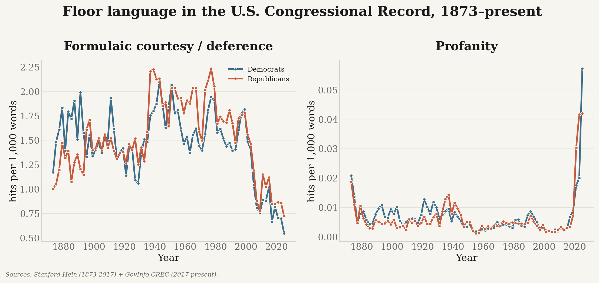

<div align="center">
  <h1>The Language of Congress</h1>
  <p><strong>Official records. Reproducible analysis. 150 years of floor speech.</strong></p>
  <p>How formal courtesy, profanity, and slurs in the Congressional Record have changed
  since 1873, by party and chamber.</p>
  <p>
    <a href="#since-1873">Overview</a> ·
    <a href="#what-is-counted">Measures</a> ·
    <a href="#explore-the-evidence">Analyses</a> ·
    <a href="#setup">Setup</a> ·
    <a href="https://www.themarginoferror.com/congressional_profanity/">Live site</a>
  </p>
</div>

---

## Since 1873

Three word-pattern measures, each a rate per 1,000 words, compare Democrats with Republicans across the
Stanford Hein corpus (1873–2017) and GovInfo's Congressional Record (2017–present). Treat a step
change at 2017 as a possible source artifact rather than a real shift.

<p align="center">
  
</p>

Matching [past-50-year figures](docs/ANALYSIS.md#past-50-years) are available alongside every
full-history chart in [`outputs/figures/`](outputs/figures).

## What is counted

| Measure | What matches | Sources |
|---|---|---|
| **Formal courtesy** | Parliamentary address and deference: “the gentleman from”, “my distinguished colleague”, “I yield”. | Hand-curated |
| **Profanity** | Curse and obscene words in a mild tier (`damn`, `crap`) and a strong tier (`shit`, `fuck`). | Hand-curated; cross-checked against LDNOOBW, Surge AI, and [Kaggle](https://www.kaggle.com/datasets/konradb/profanities-in-english-collection) |
| **Slurs** | Ethnic, sexual-orientation and gender-identity, and disability slurs used in the US. | Wikipedia's [ethnic](https://en.wikipedia.org/wiki/List_of_ethnic_slurs), [homophobic](https://en.wikipedia.org/wiki/Category:Homophobic_slurs), and [disability](https://en.wikipedia.org/wiki/List_of_disability-related_terms_with_negative_connotations) lists; cross-checked against [Kaggle](https://www.kaggle.com/datasets/konradb/profanities-in-english-collection) |

Profanity and slurs are exact lists, and no word is in both. Words that are also ordinary words,
names, places, or clinical terms (“chink in the armor”, “Redskins”, “queer”, “Gaylord”,
“retarded”) are never scored, and verb uses such as “retard the growth” are dropped.
[`slurs_provenance.tsv`](analysis/score/lexicons/slurs_provenance.tsv) records the decision for
every source entry. These are word counts, not judgments of intent: quoted material is excluded
from member rates, but a member who repeats a slur to condemn it is still counted.

Changing a word list changes past counts, so the historical series must be rescored with the
`rebuild-historical-language` and `backfill-all-speaker-terms` workflows. Until then, the site
hides any measure that older rows have not been scored for rather than showing false zeros.

## Explore the evidence

**The analysis:** [what each measure counts and the key figures](docs/ANALYSIS.md),
[methodology](docs/METHODOLOGY.md), and the [validation rubric](docs/VALIDATION_RUBRIC.md).

**The website:** [the interactive dashboard, bill data, and attribution safeguards](docs/WEBSITE.md),
published as [The Language of Congress](https://www.themarginoferror.com/congressional_profanity/)
on The Margin of Error and refreshed twice daily.

**The data:** [downloading and checking coverage of the Congressional Record](docs/DATA_PIPELINE.md)
and the [shared plotting style](docs/PLOTTING.md). Every figure is in
[`outputs/figures/`](outputs/figures).

## Setup

```bash
python3 -m venv .venv
./.venv/bin/pip install -r requirements.txt -r requirements-analysis.txt -r requirements-dev.txt
```

The routine commands, run from the repo root:

```bash
./.venv/bin/python scripts/coverage_status.py   # true date range of every ingest path
./.venv/bin/python scripts/update.py            # ingest new issues, rescore, redraw outputs/figures/
./.venv/bin/python scripts/update_speakers.py   # extend the member table behind the website
./.venv/bin/python scripts/update_language.py   # refresh current-Congress trend metrics
./.venv/bin/python scripts/update_bills.py      # refresh current-Congress bill statuses
./.venv/bin/python scripts/build_site.py        # render site/ from the committed tables
./.venv/bin/python -m pytest tests/ -q          # offline test suite
```

See each document above for full options, the one-time historical seeds, and source citations.

## Data integrity

Every number is computed from real Congressional Record text; nothing is synthesized. Scheduled
updates need no API keys. A GovInfo key is needed only for the API downloader and the one-time
Congress.gov bill seed. Raw and intermediate data live under `data/` (git-ignored, regenerable).
The small state tables behind the website (`data/site/`) and the figures in `outputs/` are
committed. Quotations, procedural speech, and printed material are excluded from member
attributions, and the scheduled workflow runs the test suite before it publishes.

Congressional Record data courtesy of the U.S. Government Publishing Office via
[GovInfo](https://www.govinfo.gov/). The parsed Hein corpus is from Gentzkow, Shapiro & Taddy,
*Congressional Record for the 43rd–114th Congresses* (Stanford Libraries, 2018), ODC-BY 1.0.
