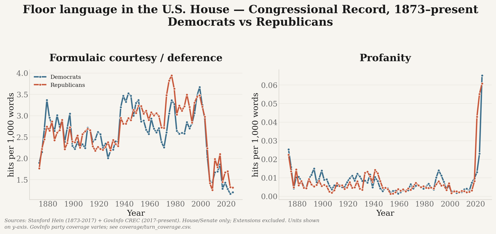
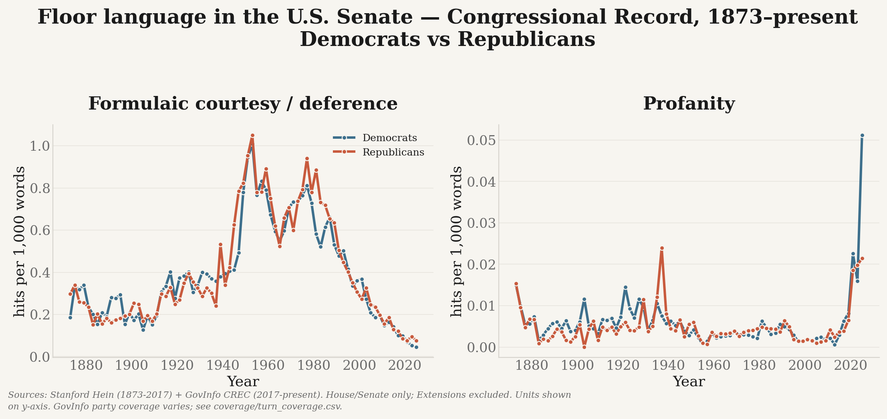
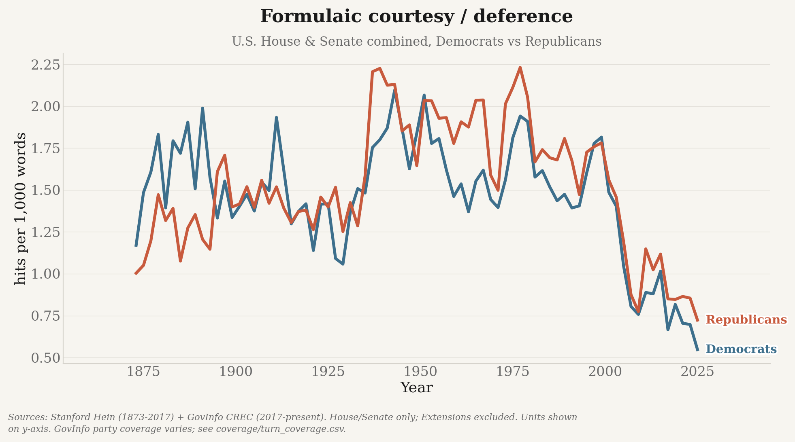
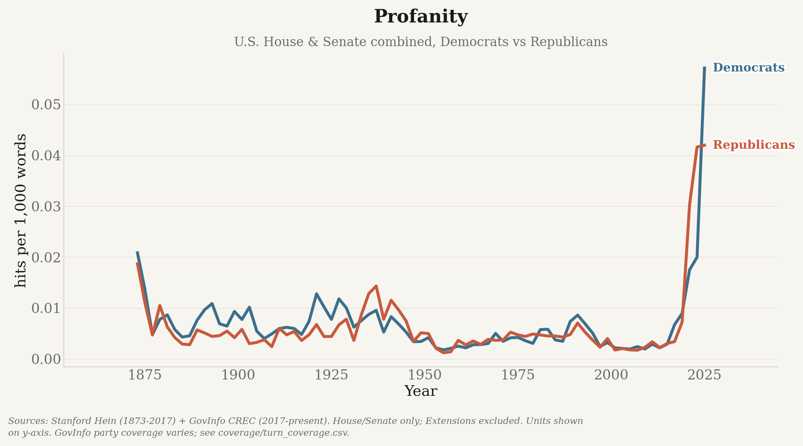

# Analysis: profanity, slurs, and formal courtesy in Congress

Beyond downloading, this repo includes a reusable **analysis pipeline** (`analysis/`) that
scores every speaker turn for three disclosed word-pattern measures and produces
time-series charts. It unifies two corpora into one speaker-turn table:

* **Stanford *hein* corpus** (1873–2017, congresses 043–114) — already speaker-segmented with
  party labels. Download the `hein-bound.zip` / `hein-daily.zip` from
  <https://data.stanford.edu/congress_text> into `data/raw/` (extract not required; the
  ingester reads the zips directly). On macOS these are zip64 >4 GB — use `ditto`/Python
  `zipfile`, not `unzip`, if you do extract them.
* **GovInfo CREC** (2017→present) — the `fetch_crec.py` output (see [`DATA_PIPELINE.md`](DATA_PIPELINE.md)); granules are segmented
  into speaker turns and party is attributed from MODS. For a **much faster** bulk load that
  bypasses the API's rate limit, use `ingest-govinfo-bulk` (below), which downloads whole-day
  package zips directly from `www.govinfo.gov/content/pkg` (no API key, not rate-limited),
  parses each day's MODS per granule, and deletes each zip after ingest.

## Key figures

These publication figures are generated from real Stanford/GovInfo Congressional Record text and
are intentionally tracked under `outputs/figures/`. All rates are per 1,000 words unless noted,
and every panel carries the coverage caveat described under
[Two ingest paths](DATA_PIPELINE.md#two-ingest-paths--check-coverage-before-you-trust-a-date). Note that the
primary source switches from Stanford Hein to GovInfo CREC in 2017, so treat a step change
across that year as possibly a source artifact rather than a real shift.
Regenerate them all with `python scripts/update.py`.

### At a glance

The three headline measures on one canvas: formal courtesy, profanity, and slurs.


The same panels for each chamber separately, each with its own y-scale so the House's higher
rates do not flatten the Senate.





### Formal courtesy

Formulaic deference (“my distinguished colleague”, “the gentleman from…”, “I yield”) is the most
institutionalised floor ritual, and the most sensitive to changes in procedure.



### Profanity and slurs

Both use curated exact lists rather than broad word lists, so they are rare by construction.



Per-chamber versions of each measure, plus the mild and strong profanity tiers, are in
[`outputs/figures/`](../outputs/figures/). Charts are drawn only for measures the metrics table
has scored: the slur figures (`slurs_per_1k.png` and its chamber pair) and the profanity tiers
appear once the historical rebuild workflow (`rebuild-historical-language.yml`) has rescored the
corpus with codebook v5. Until then the committed courtesy and profanity figures use the previous
profanity list, which lacked the Kaggle compound forms.

## What it measures

* **Formal courtesy**: conventional parliamentary address and deference.
* **Profanity**: a hand-curated list of genuine curse and obscene forms, split into a mild tier
  (`damn`, `what the hell`, `crap`, …) and a strong tier (`shit`, `fuck`, …). Ordinary topical words
  (`sex trafficking`, `erected`, `In God We Trust`) are never counted.
* **Slurs**: slurs used in the United States against three groups, cross-checked against the
  Kaggle
  [Profanities in English collection](https://www.kaggle.com/datasets/konradb/profanities-in-english-collection).
  * *Ethnic* slurs from Wikipedia's [List of ethnic slurs](https://en.wikipedia.org/wiki/List_of_ethnic_slurs). A row is
    included when its location is the US, North America, worldwide, or international, or when
    its targets or notes tie the term to American usage.
  * *Sexual-orientation and gender-identity* slurs from Wikipedia's
    [homophobic](https://en.wikipedia.org/wiki/Category:Homophobic_slurs) and
    [LGBTQ-related](https://en.wikipedia.org/wiki/Category:LGBTQ-related_slurs) slur categories
    (`faggot`, `dyke` compounds, `tranny`, …).
  * *Disability* slurs from Wikipedia's
    [list of disability-related terms with negative connotations](https://en.wikipedia.org/wiki/List_of_disability-related_terms_with_negative_connotations),
    keeping only terms used as slurs (`retard`, `spaz`, `window licker`, …). Descriptive words with
    negative connotations (`blind`, `handicapped`) and former clinical labels now used as general
    insults (`idiot`, `moron`) are not counted.

  Forms that are also ordinary words, names, places, or clinical terms (“chink in the armor”,
  “Redskins”, “Jim Crow”, bare “dyke”, “queer”, “Gaylord”, “retarded”, “cripple”) go to
  `slurs_ambiguous_audit.txt` and are never scored. Context rules drop verb uses of “retard”
  (“to retard the growth”), archaic “faggot(s) of” sticks, “homo sapiens”, and line-break
  fragments such as “homo- geneous”. Gendered insults (`bitch`, `whore`) stay in profanity. Every
  source row and the decision made about it is recorded in
  `analysis/score/lexicons/slurs_provenance.tsv`.

A form may not appear in both the profanity and the slur lists; the scorer refuses to load if it
does.

All rates are per 1,000 words, grouped by `(congress, chamber, party)`, so trends can be split
by party and chamber. Aggregation also writes `data/processed/coverage/turn_coverage.{csv,parquet}`
with total, procedural, and D/R/I-attributed turn/word coverage by source, Congress, and chamber.

**Matching.** Formal courtesy matches morphological variants by default (`Scorers(fuzzy=True)`):
single words expand to plurals and verb forms, with an irregular-plural table
(“colleague”→“colleagues”, “gentleman”→“gentlemen”). Profanity and slurs use curated exact
forms instead of unsafe morphology. Hyphenated words are single tokens, so “honky-tonk” does not
match “honky”. Matched spans are de-duplicated, so a multi-word slur counts once rather than once
per component word. Pass `fuzzy=False` for strict exact matching of courtesy forms.

**By party and by chamber.** Headline charts exclude Extensions and other sections and render
House and Senate floor language by party, plus a per-chamber split: `overview_house.png`,
`overview_senate.png`, a `*_house.png` / `*_senate.png` pair per metric, and
`metrics_by_congress_chamber_party.csv`.

**Interpretation.** These are transparent, auditable word counts, not judgments about intent.
They miss sarcasm and target identity. Member-level website rates exclude quoted material, but a
member who repeats a slur to describe or condemn it is still counted.

## Explore interactively

```bash
.venv/bin/python -m pip install jupyter   # or: uv pip install jupyter
jupyter lab notebooks/congressional_civility.ipynb
```

The notebook loads the metrics table, plots House/Senate party trends, and scores a sample of
real source turns, printing the matched spans. The earlier 784-passage model-assisted validation
measured the previous codebook; it must be re-run for codebook v5 (see
[`docs/METHODOLOGY.md`](METHODOLOGY.md)).

## Run it

### Routine refresh: one command

```bash
.venv/bin/python scripts/update.py
```

`scripts/update.py` is the normal way to bring everything up to date. It:

1. reads the newest turn in the analysis corpus and enumerates only the CREC issues published
   since then (nothing is re-downloaded);
2. bulk-ingests those days;
3. re-runs `aggregate` incrementally, rescoring only the affected Congress;
4. re-renders the figures;
5. prints a fresh coverage report, so the run verifies itself.

Every step is idempotent — if nothing new has been published the ingest is skipped and the
aggregate is served entirely from cache. Useful flags: `--dry-run` (show the plan), `--since` /
`--until` (override the window), `--skip-viz`, `--full` (force a complete rescore).

### Individual stages

```bash
uv pip install -r requirements-analysis.txt        # pandas, pyarrow, matplotlib, ...

python -m analysis.run ingest-hein                 # hein zips -> data/interim/turns/*.parquet
python -m analysis.run ingest-govinfo-bulk         # 2017-present via day-zips (fast, no rate limit)
# Source-overlap corpus used for calibration:
python -m analysis.run ingest-govinfo-bulk --start 1994-01-01 --end 2016-12-31
python -m analysis.run aggregate                   # score turns (incremental) -> data/processed/metrics/
python -m analysis.run calibrate                   # Hein/GovInfo paired overlap diagnostics
python -m analysis.run sample-validation           # blinded real-text validation sample
python -m analysis.run viz                         # charts -> outputs/figures/

# or the whole hein pipeline in one go:
python -m analysis.run all
```

### Incremental aggregation

`aggregate` is incremental by default. Scoring is done per **shard** and each shard's sums are
cached in `data/processed/cache/aggregate_shards.json`, so a run after ingesting a few new days
rescores only the affected Congress instead of all ~21M turns.

A shard is the smallest group of turn files that must be scored together:

* **GovInfo files are grouped by Congress.** Both GovInfo ingesters mint the same
  `crec:<granuleId>#<n>` turn ids, so `govinfo_119` and `govinfo_bulk_119` may hold the same turn
  and must be deduplicated against each other. A granule maps to one package → one date → one
  Congress, so ids never collide *across* Congresses and per-Congress dedup equals global dedup.
* Every other file (e.g. `hein_114`) is its own shard.

A cached shard is reused only when its files have identical size and mtime **and** the scoring
fingerprint matches. That fingerprint covers the lexicons, `scorers.py`, `registry.py`,
`aggregate.py`, and the `--include-procedural` flag — so editing a lexicon or the
scoring logic invalidates the whole cache rather than blending old and new definitions.

Because the metrics are sums over independent groups and shards are always merged in the same
order, a cached run is **identical** to a full recompute (asserted in
`tests/test_incremental_aggregate.py`, down to the emitted CSV bytes). To force a full rescore:

```bash
python -m analysis.run aggregate --full
```

Outputs: `data/processed/metrics/civility_metrics.{parquet,csv}`,
`metrics_by_congress_chamber_party.csv`, and tracked PNG charts under `outputs/figures/`
(an `overview.png` small-multiples, `overview_house.png` / `overview_senate.png`, and one
`*.png` plus a `*_house.png` / `*_senate.png` pair per metric). Large/intermediate `data/`
outputs remain git-ignored.

Charts use a shared **Substack-style** plotting toolkit (`analysis/plotting/`, matched to the
`uk_decline` portfolio look) — see [`docs/PLOTTING.md`](PLOTTING.md) for the palette,
helpers, and how to reuse it.
