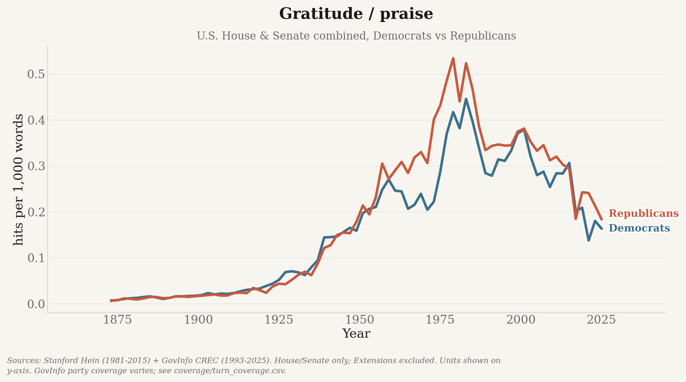
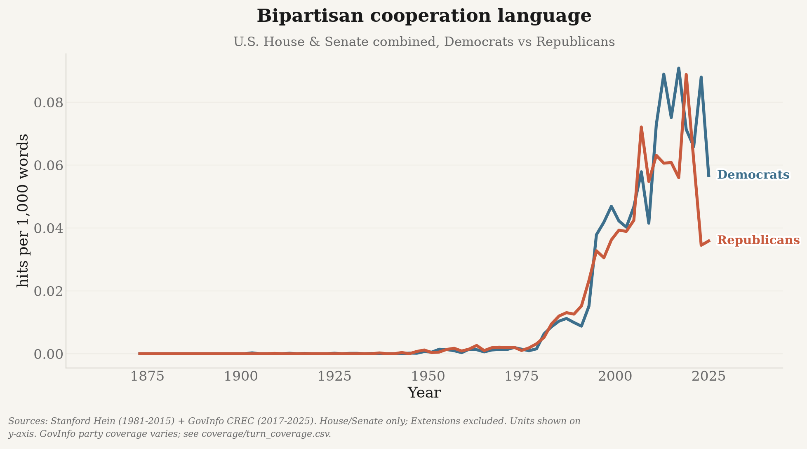
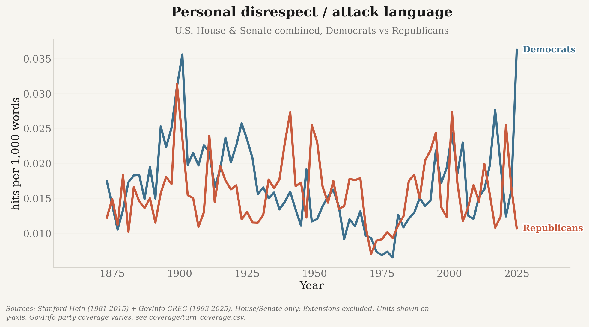
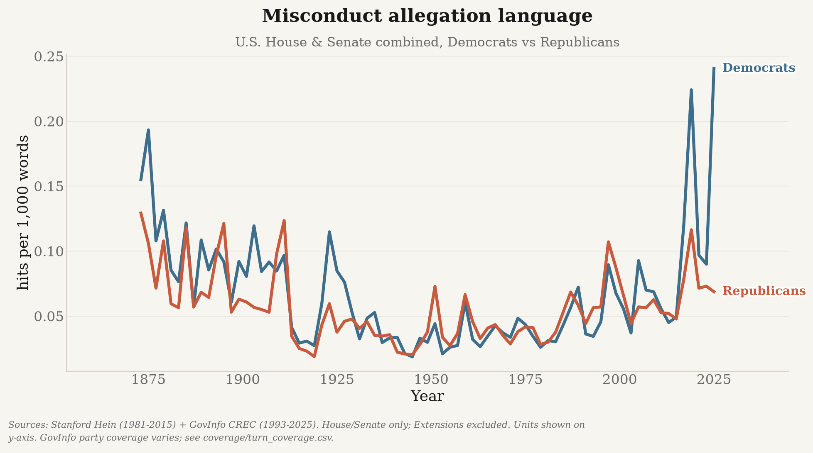
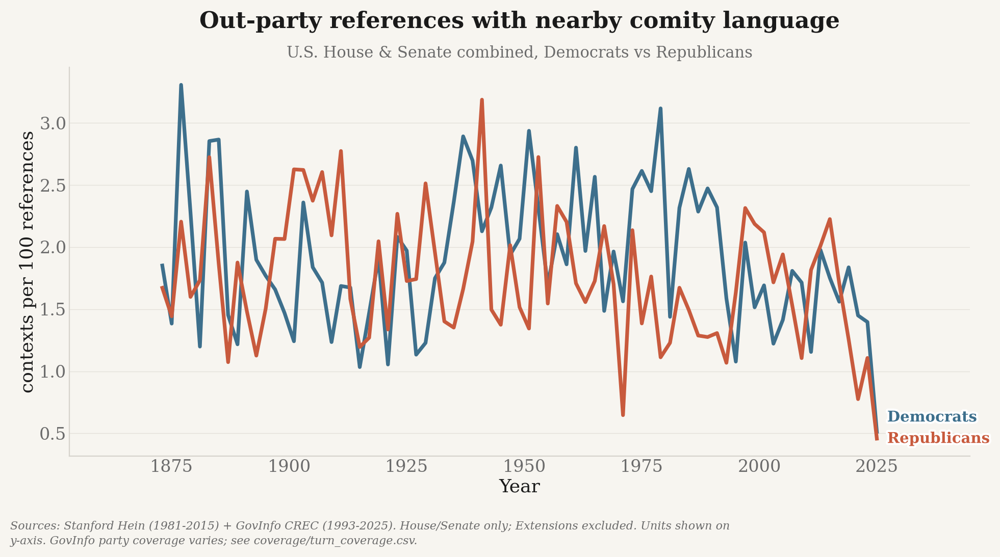
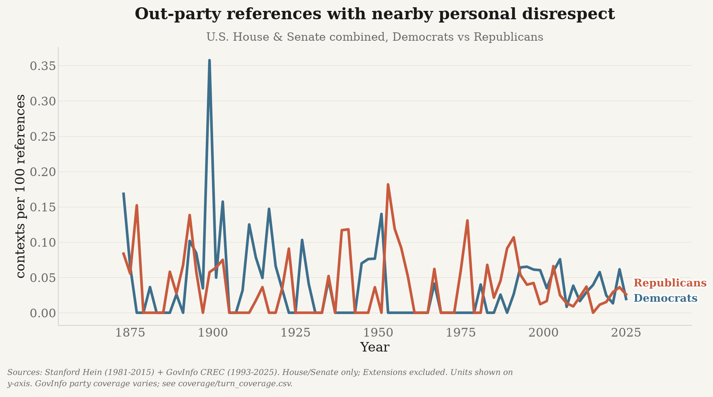
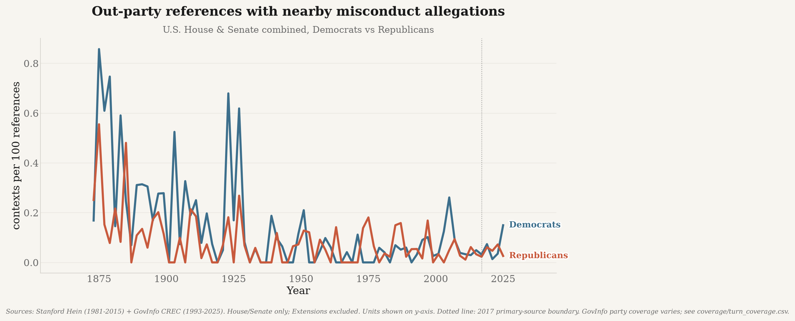
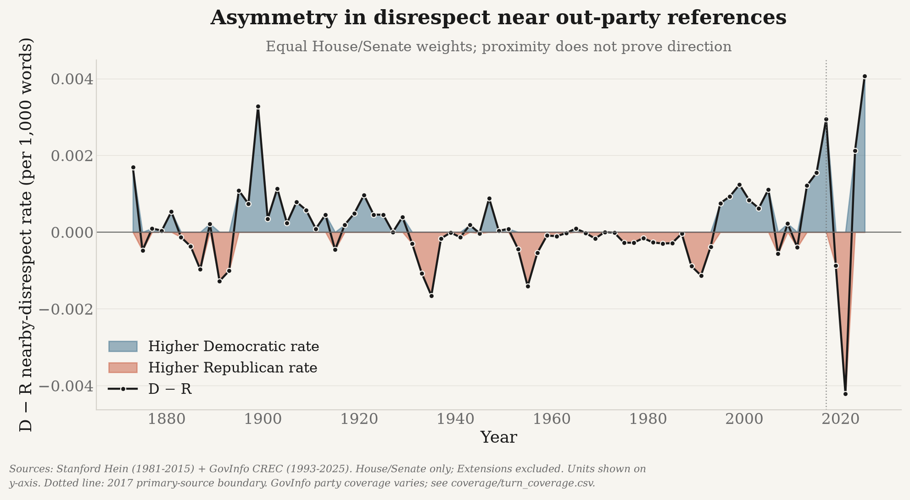

# Analysis: measuring changes in congressional comity and conflict

Beyond downloading, this repo includes a reusable **analysis pipeline** (`analysis/`) that
scores every speaker turn for disclosed lexical markers of civility and conflict and produces
time-series charts. It unifies two corpora into one speaker-turn table:

* **Stanford *hein* corpus** (1873–2017, congresses 043–114) — already speaker-segmented with
  party labels. Download the `hein-bound.zip` / `hein-daily.zip` from
  <https://data.stanford.edu/congress_text> into `data/raw/` (extract not required; the
  ingester reads the zips directly). On macOS these are zip64 >4 GB — use `ditto`/Python
  `zipfile`, not `unzip`, if you do extract them.
* **GovInfo CREC** (2017→present) — the `fetch_crec.py` output (see [`DATA_PIPELINE.md`](DATA_PIPELINE.md)); granules are segmented
  into speaker turns and party is attributed from MODS. For a **much faster** bulk load that
  bypasses the API's rate limit, use `ingest-govinfo-bulk` (below), which downloads whole-day
  package zips directly from `www.govinfo.gov/content/pkg` (no API key, not rate-limited),
  parses each day's MODS per granule, and deletes each zip after ingest.

## Key figures

These publication figures are generated from real Stanford/GovInfo Congressional Record text and
are intentionally tracked under `outputs/figures/`. All rates are per 1,000 words unless noted,
and every panel carries the coverage caveat described under
[Two ingest paths](DATA_PIPELINE.md#two-ingest-paths--check-coverage-before-you-trust-a-date). Note that the
primary source switches from Stanford Hein to GovInfo CREC in 2017, so treat a step change
across that year as possibly a source artifact rather than a real shift.
Regenerate them all with `python scripts/update.py`.

### At a glance

Six validated measures on one canvas — the fastest way to see the long-run shape of the data.


The same six panels for each chamber separately, which separates institutional differences from
partisan ones. Giving each chamber its own figure — and its own y-scale — keeps two series per
panel instead of four, and stops the House's much higher rates from flattening the Senate.


### Courtesy and cooperation

Formulaic deference (“my distinguished colleague”, “the gentleman from…”) is the most
institutionalised form of comity, and the most sensitive to changes in floor ritual.






### Conflict

Personal disrespect, allegations of misconduct, and profanity — the three negative families.
Profanity uses a high-precision curated list rather than a broad word list, so it is rare by
construction.






### Directed at the other party

The measures above count language anywhere in a speech. These normalise by *references to the
other party*, so they answer a sharper question: when a member invokes the other side, how do
they talk about them? Proximity does not prove the language is aimed at the reference.







Party asymmetry in that directed disrespect, with equal House/Senate weights — above zero means
the Democratic rate is higher, below zero the Republican rate.



The remaining figures — per-chamber breakdowns of each family, plus supplemental measures such as
ideological labelling, out-party reference volume, and the “Democrat party” pejorative — are in
[`outputs/figures/`](../outputs/figures/).

## What it measures

* **Formulaic courtesy/deference**, **gratitude/praise**, and **bipartisan cooperation** as
  separate positive-language components rather than one undifferentiated comity score
* **Personal disrespect/attack** language, **misconduct allegation language**, and
  **profanity** as separate categories. Profanity uses a narrow, hand-curated list rather than a
  broad word list, so ordinary words are never counted. Misconduct words are allegations in text,
  not evidence that misconduct occurred.
* **Identity slurs** and **ideological labels** as separate diagnostics; ideological labels do
  not automatically count as personal disrespect.
* **Cross-party reference context** — out-group references resolved to the speaker's party, plus
  comity, disrespect, or misconduct terms **near** each reference. Proximity does not prove target.
  Context-normalized outputs report affected contexts per 100 out-party references as well as
  nearby hit rates per 1,000 total words.
* The **"Democrat party"** pejorative marker; optional **VADER sentiment** (see *Toxicity* below)

All lexical rates are per 1,000 words, grouped by `(congress, chamber, party)`, so overall
trends split by party and chamber, plus D-R differences in nearby language, can all be plotted.
Aggregation also writes `data/processed/coverage/turn_coverage.{csv,parquet}` with total,
procedural, and D/R/I-attributed turn/word coverage by source, Congress, and chamber.

**Fuzzy keyword matching.** Most lexicon terms match their morphological variants by default
(`Scorers(fuzzy=True)`): single words expand to plurals/verb-forms via suffix rules plus an
irregular-plural table ("colleague"→"colleagues", "coward"→"cowards", "gentleman"→"gentlemen"),
and multi-word phrases inflect **every** content word inline in the regex, so "reach across the
aisle" also matches "reaches/reached/reaching across the aisle". Short tokens (< 4 chars) are
matched literally so obfuscation stubs are never expanded into ordinary words. Profanity and
identity-slur codebooks use curated exact variants rather than unsafe morphology. Misconduct also
uses exact curated forms because broad suffix expansion produced legal-topic false positives.
Matched spans are de-duplicated so phrases and component words are not double-counted. Pass
`fuzzy=False` for strict exact matching on the remaining codebooks.

**By party and by chamber.** Headline charts exclude Extensions/other sections and render
House/Senate floor language by party, plus a
**per-chamber** split (House and Senate as separate figures, each by party):
`overview_house.png`, `overview_senate.png`, a `*_house.png` / `*_senate.png` pair per metric,
and an extra CSV `metrics_by_congress_chamber_party.csv`.

**Toxicity methodology.** "Toxicity" is shorthand for several transparent, auditable
**lexical rates** (personal disrespect/profanity per 1k words), not a ground-truth label or a
black-box classifier. Optional VADER sentiment
(`--sentiment`) is scored **per sentence and averaged** (VADER's `compound` saturates on long
passages, so scoring a whole speech is biased), exposing `mean_sentiment` and `mean_neg_share`,
which are **sentence-count weighted** in the aggregate; lexical rates are separately word-weighted.
The interactive notebook checks whether these signals converge and can optionally compare
a sample with Detoxify; neither diagnostic substitutes for independent human ground truth.

## Explore interactively

```bash
.venv/bin/python -m pip install jupyter   # or: uv pip install jupyter
jupyter lab notebooks/congressional_civility.ipynb
```

The notebook loads the metrics table, plots House/Senate party trends, and runs diagnostics on
real source turns. Completed model-assisted rubric grading preserves `turn_id`, uses two blinded
passes plus separate adjudication, and is disclosed as model-assisted rather than human validation.
The 784-passage precision/recall summary is documented in
[`docs/METHODOLOGY.md`](METHODOLOGY.md) and generated at
`data/processed/validation/precision_recall.csv`.

## Run it

### Routine refresh: one command

```bash
.venv/bin/python scripts/update.py
```

`scripts/update.py` is the normal way to bring everything up to date. It:

1. reads the newest turn in the analysis corpus and enumerates only the CREC issues published
   since then (nothing is re-downloaded);
2. bulk-ingests those days;
3. re-runs `aggregate` incrementally, rescoring only the affected Congress;
4. re-renders the figures;
5. prints a fresh coverage report, so the run verifies itself.

Every step is idempotent — if nothing new has been published the ingest is skipped and the
aggregate is served entirely from cache. Useful flags: `--dry-run` (show the plan), `--since` /
`--until` (override the window), `--skip-viz`, `--full` (force a complete rescore).

### Individual stages

```bash
uv pip install -r requirements-analysis.txt        # pandas, pyarrow, matplotlib, vader, ...

python -m analysis.run ingest-hein                 # hein zips -> data/interim/turns/*.parquet
python -m analysis.run ingest-govinfo-bulk         # 2017-present via day-zips (fast, no rate limit)
# Source-overlap corpus used for calibration:
python -m analysis.run ingest-govinfo-bulk --start 1994-01-01 --end 2016-12-31
python -m analysis.run aggregate                   # score turns (incremental) -> data/processed/metrics/
python -m analysis.run calibrate                   # Hein/GovInfo paired overlap diagnostics
python -m analysis.run sample-validation           # blinded real-text validation sample
python -m analysis.run viz                         # charts -> outputs/figures/

# or the whole hein pipeline in one go (add --sentiment for VADER):
python -m analysis.run all
```

### Incremental aggregation

`aggregate` is incremental by default. Scoring is done per **shard** and each shard's sums are
cached in `data/processed/cache/aggregate_shards.json`, so a run after ingesting a few new days
rescores only the affected Congress instead of all ~21M turns.

A shard is the smallest group of turn files that must be scored together:

* **GovInfo files are grouped by Congress.** Both GovInfo ingesters mint the same
  `crec:<granuleId>#<n>` turn ids, so `govinfo_119` and `govinfo_bulk_119` may hold the same turn
  and must be deduplicated against each other. A granule maps to one package → one date → one
  Congress, so ids never collide *across* Congresses and per-Congress dedup equals global dedup.
* Every other file (e.g. `hein_114`) is its own shard.

A cached shard is reused only when its files have identical size and mtime **and** the scoring
fingerprint matches. That fingerprint covers the lexicons, `scorers.py`, `registry.py`,
`aggregate.py`, and the `--sentiment` / `--include-procedural` flags — so editing a lexicon or the
scoring logic invalidates the whole cache rather than blending old and new definitions.

Because the metrics are sums over independent groups and shards are always merged in the same
order, a cached run is **identical** to a full recompute (asserted in
`tests/test_incremental_aggregate.py`, down to the emitted CSV bytes). To force a full rescore:

```bash
python -m analysis.run aggregate --full
```

Outputs: `data/processed/metrics/civility_metrics.{parquet,csv}`,
`metrics_by_congress_chamber_party.csv`, and tracked PNG charts under `outputs/figures/`
(an `overview.png` small-multiples, `overview_house.png` / `overview_senate.png`, and one
`*.png` plus a `*_house.png` / `*_senate.png` pair per metric). Large/intermediate `data/`
outputs remain git-ignored.

Charts use a shared **Substack-style** plotting toolkit (`analysis/plotting/`, matched to the
`uk_decline` portfolio look) — see [`docs/PLOTTING.md`](PLOTTING.md) for the palette,
helpers, and how to reuse it.
